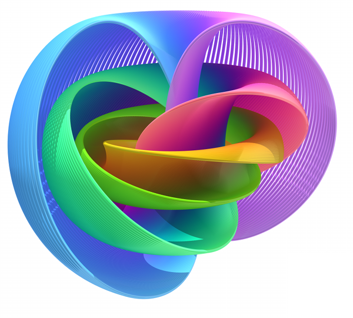

# Open-Source Quantum Software Projects

Curated list of open-source developed quantum software projects.

*Please read the [contribution guidelines](CONTRIBUTING.md#readme) before contributing.*

Also please check out the [Unitary Fund](http://unitary.fund/)'s 2k$ grant project for quantum OSS!

## Contents
- [Quantum full-stack libraries](#quantum-full-stack-libraries)
- [Quantum simulators](#quantum-simulators)
- [Quantum annealing](#quantum-annealing)
- [Quantum algorithms](#quantum-algorithms)
- [Quantum compilers](#quantum-compilers)
- [Quantum assembly](#quantum-assembly)
- [Quantum cryptography](#quantum-cryptography)
- [Experimental quantum computing](#experimental-quantum-computing)
- [Quantum fun](#quantum-fun)
- [Quantum tools](#quantum-tools)
- [Abandoned projects](#abandoned-projects)

For a curated list of learning resources please check out [desireevl's repo](https://github.com/desireevl/awesome-quantum-computing).

## Quantum full-stack libraries

**Python**
- [QISKit](https://qiskit.org/) - IBM's quantum information software kit for simulating, compiling and executing quantum programs.
- [Strawberry Fields](https://github.com/xanaduai/strawberryfields) - [Xanadu](https://www.xanadu.ai)'s software library for photonic quantum computing.
- [Forest](https://github.com/rigetticomputing/pyquil) - [Rigetti](https://www.rigetti.com/)'s software library for writing, simulating, compiling and executing quantum programs.
- [ProjectQ](https://github.com/ProjectQ-Framework/ProjectQ) - Hardware-agnostic framework with compiler and simulator with emulation capabilities.
- [Cirq](https://github.com/quantumlib/Cirq) - Framework for creating, editing, and invoking Noisy Intermediate Scale Quantum (NISQ) circuits.

**Q#**
- [Q#](https://www.microsoft.com/en-us/quantum/development-kit) - Microsoft's quantum programming language with Visual Studio integration.

**C++**
- [XACC](https://github.com/ORNL-QCI/xacc) - [Extreme-scale programming model for quantum acceleration within high-performance computing](https://arxiv.org/abs/1710.01794).

## Quantum simulators

**Python**
- [Quantum Virtual Machine](https://github.com/rigetticomputing/reference-qvm) - Reference implementation of Rigetti's Quantum Virtual Machine.
- [QuTiP](http://qutip.org/) - User-friendly and efficient numerical simulations of a wide variety of open quantum systems.
- [QTop](https://github.com/jacobmarks/QTop) - Simulation and visualization of topological quantum computers.
- [Quintuple](https://github.com/corbett/QuantumComputing) - Simulating the 5-qubit processor of the [IBM Quantum Experience](https://quantumexperience.ng.bluemix.net/qx/experience).
- [QuSim](https://github.com/adamisntdead/QuSimPy) - Ideal noise-free multi-qubit simulator written in 150 lines of code.
- [PIQS](https://github.com/nathanshammah/piqs) - Efficient simulation of open quantum dynamics of identical qubits.
- [SimulaQron](https://github.com/StephanieWehner/SimulaQron) - Application level simulator of a quantum network.

**C++**
- [Quantum++](https://github.com/vsoftco/qpp) - High-performance general purpose quantum simulator (can simulate d-dimensional qudits).
- [QCL](https://github.com/aviggiano/qcl) - High level, hardware-agnostic programming language for quantum computers (syntax like C or Pascal).
- [Qrack](https://github.com/vm6502q/qrack) - Comprehensive qubit and gate implementation for developing universal virtual quantum processors.

**C**
- [QuaC](https://github.com/0tt3r/QuaC) - Parallel time-dependent open quantum systems solver.

**Java**
- [libQuantumJava](https://github.com/gbanegas/libQuantumJava) - Crude translation from the C implementation of `libquantum` to a Java version.

**JavaScript**
- [jsquil](https://github.com/mapmeld/jsquil) - JavaScript interface for writing [Quil](https://en.wikipedia.org/wiki/Quil_(instruction_set_architecture)) programs.
- [Quirk](https://github.com/Strilanc/Quirk) - Drag-and-drop quantum circuit simulator in your browser.

**Haskell**
- [Quipper](https://github.com/thephoeron/quipper-language) - Scalable functional programming language for quantum computing based on [Quantum Lambda Calculus](https://arxiv.org/abs/cs/0404056).

**Rust**
- [QCGPU](https://github.com/QCGPU/qcgpu-rust) - High-performance GPU-accelerated quantum computer simulation outlined in this [arXiv paper](https://arxiv.org/pdf/1805.00988.pdf).

**Julia**
- [QuantumInfo.jl](https://github.com/BBN-Q/QuantumInfo.jl) - Julia library for quantum information related calculations.
- [QSimulator.jl](https://github.com/BBN-Q/QSimulator.jl) - Unitary and Lindbladian evolution in Julia.
- [RandomQuantum.jl](https://github.com/BBN-Q/RandomQuantum.jl) - Package for generating random quantum states and processes.
- [Cliffords.jl](https://github.com/BBN-Q/Cliffords.jl) - Efficient calculation of Clifford circuits in Julia.

**Common Lisp**
- [BLACK-STONE](https://github.com/thephoeron/black-stone) - Specification and implementation of quantum common lisp, for gate-model quantum computers.

**Qumin**
- [Qlmp](https://github.com/wintershammer/QImp) -  Interpreter for the functional quantum programming language Qumin.

**F#**
- [Liqui|>](http://stationq.github.io/Liquid/) - Toolsuite for quantum simulation developed by [Microsoft QuArC](https://www.microsoft.com/en-us/research/group/quantum-architectures-and-computation-group-quarc/).

**OCaml**
- [QOCS](https://github.com/dillanchang/QOCS) - Quantum OCaml Circuit Simulator is a functional approach to simulating quantum gates.

**Mathematica**
- [QuantumUtils](https://github.com/QuantumUtils/quantum-utils-mathematica) - Tools for quantum control, simulation, channel representation conversion, and perturbations.

## Quantum annealing

**Python, C & Matlab**
- [Qbsolv](https://github.com/dwavesystems/qbsolv) - QUBO solver with [D-Wave](https://www.dwavesys.com) or classical tabu solver backend.

**Python**
- [dwave_networkx](https://github.com/dwavesystems/dwave_networkx) - Exploration and analysis of network graphs.
- [dimod](https://github.com/dwavesystems/dimod) - Shared API for Ising and QUBO problems.
- [sapi_dimod](https://github.com/dwavesystems/dwave_sapi_dimod) - [Dimod](https://github.com/dwavesystems/dimod) wrapper for D-Wave's Solver API (SAPI).
- [micro_client_sapi_dimod](https://github.com/dwavesystems/dwave_micro_client_dimod) - [Dimod](https://github.com/dwavesystems/dimod) wrapper for the D-Wave Micro Client.
- [minorminer](https://github.com/dwavesystems/minorminer) - Heuristic tool for minor graph embedding.
- [penaltymodel](https://github.com/dwavesystems/penaltymodel) - Utilities and interfaces for using penalty models.
- [penaltymodel_maxgap](https://github.com/dwavesystems/penaltymodel_maxgap) - Generates penalty models with smt solves. Factory & Cache for [penaltymodel](https://github.com/dwavesystems/penaltymodel).
- [embedding_utilities](https://github.com/dwavesystems/dwave_embedding_utilities) - Mapping samples between original and embedded graph.
- [dwave-system](https://github.com/dwavesystems/dwave-system) - Incorporating D-Wave quantum annealers as samplers in the D-Wave Ocean (?) software stack.
- [dwave-cloud-client](https://github.com/dwavesystems/dwave-cloud-client) - Min. implementation of the REST interface to communicate with D-Wave's Solver API.
- [chimera_embedding](https://github.com/dwavesystems/chimera-embedding) - Algorithms to generate native-structured embeddings for Chimera graphs.

**C++**
- [Virtual Hardware Embedding](https://github.com/ORNL-QCI/aqc-virtual-embedding) - Virtual Hardware Embedding Suite for adiabatic quantum computing.

## Quantum algorithms

**Python**
- [Grove](https://github.com/rigetticomputing/grove) - Quantum algorithms implemented using [Rigetti](https://www.rigetti.com/)'s [pyQuil](https://github.com/rigetticomputing/pyquil).
- [QISKit AQUA](https://github.com/Qiskit/aqua) - Library of various quantum algorithm implemented with [QISKit](https://github.com/Qiskit/qiskit-terra).
- [QISKit Tutorial](https://github.com/QISKit/qiskit-tutorial) - Jupyter notebook filled with tutorials for [QISKit](https://github.com/QISKit/qiskit-terra).
- [OpenFermion](https://github.com/quantumlib/OpenFermion) - Compiling and analyzing quantum algorithm for quantum chemistry simulations.
- [XACC Examples](https://github.com/ORNL-QCI/xacc-examples) - Example code using [XACC](https://github.com/ORNL-QCI/xacc) for quantum computing.
- [XACC QChem](https://github.com/ORNL-QCI/xacc-qchem-benchmarks) - QPU Benchmarks for Quantum Chemistry via [XACC](https://github.com/ORNL-QCI/xacc), [Psi4](http://www.psicode.org/) and [OpenFermion](https://github.com/quantumlib/OpenFermion).
- [Adapt](https://github.com/BBN-Q/Adapt) - Algorithms for adaptive refinement of measurements.
- [QFog](https://github.com/artiste-qb-net/quantum-fog) - Tools for analyzing both classical and quantum Bayesian Networks.

**Julia**
- [QuantumTomography.jl](https://github.com/BBN-Q/QuantumTomography.jl) - Julia package to perform quantum state and process tomography.

**C++**
- [XACC VQE](https://github.com/ORNL-QCI/xacc-vqe) - Distributed Variational Quantum Eigensolver built on [XACC](https://github.com/ORNL-QCI/xacc) for solving electronic structure problems.

**Q#**
- [Quantum Katas](https://github.com/Microsoft/QuantumKatas) -  Programming exercises for learning Q# and quantum computing.

## Quantum compilers

**C++**
- [Qubiter](http://www.ar-tiste.com/qubiter.html) - Quantum compiler using CS Decomposition to build a binary tree of matrices.
- [ScaffCC](https://github.com/epiqc/ScaffCC) - Compilation, analysis and optimization framework for the Scaffold quantum programming language.

**Python**
- [QGL2 Compiler](https://github.com/BBN-Q/pyqgl2) - Language compiler for imperative Quantum Gate Language ([QGL](https://github.com/BBN-Q/QGL)).
- [PyZX](https://github.com/Quantomatic/pyzx) - Python library for quantum circuit rewriting and optimisation using the ZX-calculus.

**Julia**
- [QGL.jl](https://github.com/BBN-Q/QGL.jl) - A performance orientated [QGL](https://github.com/BBN-Q/QGL) compiler.

## Quantum assembly

- [Quil](https://arxiv.org/abs/1608.03355) - An open hybrid quantum/classical instruction set currently used by Rigetti. [Parser](https://github.com/rigetticomputing/pyquil/tree/master/pyquil/_parser)
- [OpenQASM](https://github.com/QISKit/openqasm) - IBM's open-source quantum assembly language.
- [QMASM](https://github.com/lanl/qmasm) - A quantum macro assembler for D-Wave's quantum annealers.

## Quantum cryptography

**C**
- [liboqs](https://github.com/open-quantum-safe/liboqs) - C library for quantum-resistant cryptographic algorithms.
- [openssh](https://github.com/open-quantum-safe/openssh-portable) - OpenSSH with quantum-safe key exchange algorithms.
- [openssl](https://github.com/open-quantum-safe/openssl) - OpenSSL with quantum-safe cryptographic algorithms.

## Experimental quantum computing

**Python**
- [QGL](https://github.com/BBN-Q/QGL) -  Domain-specific language embedded in python for specifying pulse sequences.
- [Quince](https://github.com/BBN-Q/Quince) - Node-based GUI that allows for graphical configuration of qubit experiments in Auspex.
- [PyQLab](https://github.com/BBN-Q/PyQLab) - Library for instrument control and superconducting QIP experiments.
- [ARTIQ](https://github.com/m-labs/artiq) - Next-generation control system for quantum information experiments.
- [qc-toolkit](https://github.com/qutech/qc-toolkit) - Quantum Computing Toolkit for Qubit Control.
- [QFlow-lite](https://github.com/jpzwolak/QFlow-lite) - Machine Learning tools for autotuning quantum dot experiments.

**Matlab**
- [Qlab](https://github.com/BBN-Q/Qlab) - Measurement and control software for superconducting qubits.

**Julia**
- [Qlab.jl](https://github.com/BBN-Q/Qlab.jl) - Generic lab tools in Julia.

## Quantum fun

**Python**
- [Quantum Awesomeness](https://github.com/decodoku/A_Game_to_Benchmark_Quantum_Computers)	- [Simple puzzles to benchmark various quantum processor](https://medium.com/@decodoku/understanding-quantum-computers-through-a-simple-puzzle-game-a290dde89fb2).
- [Quantum Battleships](https://github.com/decodoku/Battleships_with_complementary_measurements) - [Playing battleships with quantum measurements](https://medium.com/@decodoku/how-to-program-a-quantum-computer-part-2-f0d3eee872fe).
- [QSEL](https://github.com/dabacon/qsel) -  Quantum programming language putting entanglement and superposition front and center.

**Python & JavaScript**
- [Quantum Music Composer for Rigetti](https://github.com/JavaFXpert/quantum-toy-piano) - Compose and perform quantum music with Rigetti's Forest.
- [Quantum Music Composer for IBM Q](https://github.com/JavaFXpert/quantum-toy-piano-ibmq) - Compose and perform quantum music with IBM Q.

**Board games**
- [Entanglion](https://github.com/Entanglion/entanglion) - The world’s first open source quantum computing board game. For 2 players.

## Quantum tools

**Python**
- [IBM Q bot](https://github.com/RQC-QApp/QuantumComputingBot) - Bot for Slack and Telegram to monitor the load of IBM Q quantum computers.

## Abandoned projects
*2+ years of inactivity. Feel free to reanimate, document and contribute to some of this work!*
- [QACG](https://github.com/QCT-IQC/qacg) - Quantum Arithmetic Circuit Generator in Haskell.
- [QCViewer](https://github.com/QCT-IQC/QCViewer) - A visual quantum circuit design and simulation tool.
- [libquantum](http://libquantum.de) - C library for quantum computing and quantum simulation.
- [Squankum](https://github.com/jeffwass/Squankum) - Visual Java quantum simulator.
- [PySimulator](https://github.com/BBN-Q/PySimulator) - Python with C++ backend simulator for superconducting circuits.
- [pQCS](https://qsoft.iqc.uwaterloo.ca/#software) - [Parallel quantum circuit synthesis](https://uwspace.uwaterloo.ca/handle/10012/9267) with optimal T-count.

## Contributing
See the [contribution guidelines](CONTRIBUTING.md/#readme).

## License

To the extent possible under law, Mark Fingerhuth has waived all copyright and related or neighboring rights to this work.
